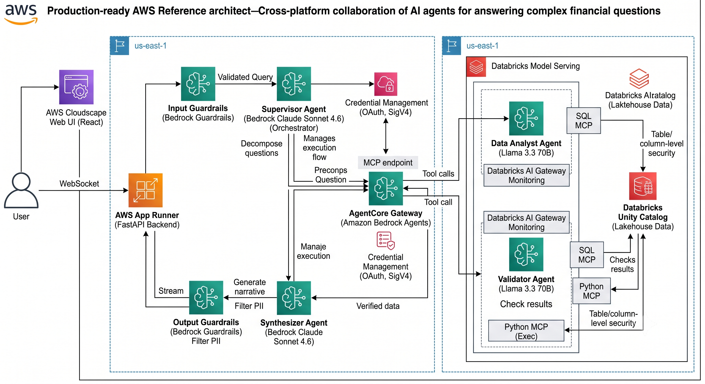

# Multi-Agent Financial Analyst

**Hybrid multi-agent system combining Amazon Bedrock AgentCore with Databricks Agent Framework**

A production-ready reference architecture demonstrating how AI agents on two cloud platforms collaborate to answer complex financial questions — with full governance, MCP-based tool routing, and real-time observability.

---

## Architecture

```
┌─────────────── User (Web UI) ────────────────────────────────────────────────┐
│  React + Cloudscape Design System                                            │
│  Real-time agent flow visualization | Example queries | Mode selection       │
└──────────────────────────┬───────────────────────────────────────────────────┘
                           │ WebSocket
┌──────────────────────────▼───────────────────────────────────────────────────┐
│  FastAPI Backend (Python)                                                    │
└──────────────────────────┬───────────────────────────────────────────────────┘
                           │
┌──────────── AWS ─────────┼──────────────────┐    ┌──── Databricks ──────────┐
│                          ▼                   │    │                          │
│  Bedrock Claude (Supervisor)                 │    │  Model Serving           │
│  - Decomposes questions into sub-tasks       │    │                          │
│  - Plans execution order                     │    │  ┌──────────────────┐    │
│          │                                   │    │  │  Data Analyst    │    │
│          ▼                                   │    │  │  (Llama 70B +    │    │
│  AgentCore Gateway (MCP)                     │    │  │   SQL MCP)       │    │
│  - Routes tool calls to Databricks    ───────┼───►│  └──────────────────┘    │
│  - Handles OAuth token exchange              │    │                          │
│  - SigV4 authentication                     │    │  ┌──────────────────┐    │
│          │                                   │    │  │  Validator       │    │
│          ▼                                   │    │  │  (Llama 70B +    │    │
│  Bedrock Claude (Synthesizer)                │    │  │   SQL MCP +      │    │
│  - Generates narrative from results          │    │  │   python_exec)   │    │
│  - Applies output guardrails                 │    │  └──────────────────┘    │
│                                              │    │                          │
│  [Input Guardrails] [Output Guardrails]      │    │  [Unity Catalog]         │
│                                              │    │  [AI Gateway Monitoring] │
└──────────────────────────────────────────────┘    └──────────────────────────┘
```



### Component Descriptions

#### Web UI (React + Cloudscape Design System)
The user-facing web console built with AWS's open-source Cloudscape Design System. Provides a query input with 6 example financial questions, a mode selector (Standard vs. Strands SDK agents), and real-time agent flow visualization. Connects to the backend via WebSocket to stream execution events as each agent step completes. The horizontal workflow diagram shows each agent as a clickable box with platform badges (AWS/Databricks), status animations, and expandable detail panels.

#### FastAPI Backend
A lightweight Python API server that bridges the UI with the agent orchestration layer. Exposes a WebSocket endpoint (`/ws/query`) that streams real-time execution events — guardrail checks, supervisor planning, agent invocations, and final results. Reuses the same orchestration code as the CLI without duplication.

#### Supervisor Agent (AWS — Bedrock Claude Sonnet 4.6)
The orchestrator that receives the user's question and decomposes it into an ordered execution plan. It determines which sub-agents to invoke, in what order, and with what dependencies. For example, a question about sector risk exposure gets split into: (1) query current positions, (2) query historical metrics, (3) validate consistency, (4) synthesize narrative. The Supervisor calls Databricks agents as tools through the AgentCore Gateway.

#### Amazon Bedrock AgentCore Gateway
A fully managed MCP (Model Context Protocol) endpoint that acts as the bridge between AWS and Databricks. It aggregates Databricks serving endpoints as OpenAPI targets, handles OAuth token exchange automatically (no manual token management), and routes tool calls using the MCP protocol over HTTPS. Authentication to the Gateway uses AWS SigV4; authentication to Databricks uses OAuth client credentials managed by the Gateway's credential provider.

#### Data Analyst Agent (Databricks — Llama 3.3 70B)
Deployed on Databricks Model Serving, this agent has native access to the workspace's Managed MCP servers. When invoked, it discovers relevant table schemas via SQL MCP, writes and executes Spark SQL queries against `finserv_catalog`, and returns structured results with the SQL used, tables accessed, and a natural language summary. Uses the `databricks-meta-llama-3-3-70b-instruct` foundation model for reasoning and tool calling.

#### Validator Agent (Databricks — Llama 3.3 70B)
Also deployed on Databricks Model Serving, this agent cross-checks the Data Analyst's results for consistency, anomalies, and correctness. It can run validation SQL queries via MCP and execute Python-based statistical checks via `system.ai.python_exec`. Returns a confidence assessment (HIGH/MEDIUM/LOW) with explicit checks passed and failed.

#### Synthesizer Agent (AWS — Bedrock Claude Sonnet 4.6)
The final agent in the pipeline. It receives the validated query results and generates a comprehensive narrative answer including: executive summary, detailed analysis with supporting numbers, data lineage (which tables contributed), confidence level, and suggested follow-up questions. Applies output guardrails (PII filtering) before returning the response.

#### Guardrails (Input + Output)
**Input guardrails** run before any agent processing — they detect and block prompt injection attempts ("ignore previous instructions...") and off-topic requests ("write me a poem..."). **Output guardrails** run after the Synthesizer — they scan the final response for PII patterns (SSN, credit card numbers, email addresses) and filter them before delivery to the user.

#### Unity Catalog (Databricks)
The governance layer for all data access. Every SQL query executed by the Data Analyst and Validator is subject to Unity Catalog's table-level, column-level, and row-level security. The service principal can only access tables it has been explicitly granted permissions on. All MCP tool invocations are logged via Databricks AI Gateway for audit.

#### Data Flow (end-to-end)
1. User submits a question through the Web UI
2. Input guardrails check the question (block if malicious/off-topic)
3. Supervisor (Bedrock Claude) decomposes into sub-tasks with dependencies
4. Data Analyst is invoked via Gateway MCP → Databricks (queries lakehouse data)
5. Validator is invoked via Gateway MCP → Databricks (cross-checks results)
6. Synthesizer (Bedrock Claude) generates narrative from validated results
7. Output guardrails scan the response (filter PII if detected)
8. Final answer streamed to the UI with full lineage and confidence

---

## Key Features

| Feature | Implementation |
|---------|---------------|
| **Hybrid multi-agent** | Supervisor + Synthesizer on AWS Bedrock; Data Analyst + Validator on Databricks |
| **AgentCore Gateway** | MCP protocol routing with OAuth credential management |
| **Databricks MCP** | SQL + UC Functions accessed natively by Databricks-hosted agents |
| **OAuth M2M** | No PATs — secure, auto-refreshing credentials |
| **Guardrails** | Input (prompt injection, off-topic) + Output (PII filtering) |
| **Two agent modes** | Standard (manual orchestration) + Strands SDK (autonomous) |
| **Real-time UI** | WebSocket streaming with agent flow visualization |
| **Unity Catalog governance** | All data access governed by UC permissions |

---

## Quick Start

### Prerequisites

- Python 3.11+
- Node.js 18+ (for UI)
- Databricks workspace (AWS) with admin access
- AWS account with Bedrock access (us-west-2)

### 1. Clone and set up environment

```bash
git clone <repo-url>
cd hands-on-agentcore-dbx-01

python3 -m venv .venv
.venv/bin/pip install -r requirements.txt
```

### 2. Configure credentials

```bash
cp .env.example .env
# Edit .env with your values (see docs/databricks-setup-guide.md for Databricks setup)
```

**All environment variables:**

| Variable | Required | Description | Where to Get It |
|----------|----------|-------------|-----------------|
| **Databricks** | | | |
| `DATABRICKS_HOST` | Yes | Workspace URL | Browser URL when logged into Databricks |
| `DATABRICKS_CLIENT_ID` | Yes | Service principal Application ID | Settings → Service principals → Configurations tab |
| `DATABRICKS_CLIENT_SECRET` | Yes | Service principal OAuth secret | Settings → Service principals → Secrets tab → Generate |
| `DATABRICKS_WAREHOUSE_ID` | Yes | SQL Warehouse ID | SQL Warehouses → click warehouse → Connection details |
| `DATABRICKS_CATALOG` | Yes | Unity Catalog name (default: `finserv_catalog`) | Created by data generation script |
| `DATABRICKS_ADMIN_USER` | Yes | Your admin email for UI access | The email you log into Databricks with |
| `DATABRICKS_LLM_ENDPOINT` | Yes | Foundation model endpoint for Databricks agents | Serving page (default: `databricks-meta-llama-3-3-70b-instruct`) |
| **AWS** | | | |
| `AWS_ACCESS_KEY_ID` | Yes | AWS access key | IAM → Users → Security credentials → Create access key |
| `AWS_SECRET_ACCESS_KEY` | Yes | AWS secret key | Shown once at access key creation |
| `AWS_REGION` | Yes | AWS region (default: `us-west-2`) | Must match Bedrock model availability |
| `AWS_DEFAULT_REGION` | Yes | Same as AWS_REGION | Set to same value |
| `AGENTCORE_GATEWAY_ID` | After step 6 | Gateway ID (includes random suffix) | Output of Gateway setup script |
| `SECRETS_MANAGER_SECRET_NAME` | Optional | Secret name in Secrets Manager | Default: `databricks/finserv-analyst/credentials` |
| **Models** | | | |
| `BEDROCK_MODEL_ID` | Yes | Bedrock model for Supervisor + Synthesizer | Default: `us.anthropic.claude-sonnet-4-6` |
| **Serving Endpoints** | | | |
| `DATA_ANALYST_ENDPOINT_NAME` | Yes | Databricks serving endpoint name | Default: `finserv-data-analyst` |
| `VALIDATOR_ENDPOINT_NAME` | Yes | Databricks serving endpoint name | Default: `finserv-validator` |

### 3. Validate Databricks connectivity

```bash
.venv/bin/python -m infrastructure.databricks.workspace_setup
```

### 4. Generate synthetic data

```bash
.venv/bin/python -m data.generate_synthetic
```

Creates `finserv_catalog` with 11 tables and ~23,000 rows of financial data.

### 5. Deploy Databricks agents

```bash
.venv/bin/python -m databricks_agents.deploy_agents
```

Deploys Data Analyst and Validator to Model Serving (~5-10 min to become ready).

### 6. Set up AgentCore Gateway

```bash
.venv/bin/python -m infrastructure.aws.agentcore_gateway_setup
```

Creates Gateway, OAuth provider, and registers Databricks endpoints as targets.

### 7. Run the pipeline (CLI)

```bash
# Standard agents
.venv/bin/python -m agentcore.main "How many customers do we have?"

# Strands SDK agents
.venv/bin/python -m agentcore.strands.main_strands "What is our Technology sector exposure?"
```

### 8. Run the Web UI

```bash
# Terminal 1: Backend
.venv/bin/pip install fastapi uvicorn websockets
.venv/bin/python -m ui.backend.server

# Terminal 2: Frontend
cd ui && npm install && npm start
```

Open http://localhost:3000

---

## Project Structure

```
hands-on-agentcore-dbx-01/
├── agentcore/                       # AWS-side agents (Supervisor, Synthesizer)
│   ├── main.py                      # Orchestrator (routes through Gateway)
│   ├── agents/                      # Agent definitions + prompts
│   ├── strands/                     # Strands SDK alternative implementation
│   ├── gateway/                     # Gateway target configurations
│   ├── config/                      # Settings, guardrails
│   └── models/                      # Data models (subtask, responses)
│
├── databricks_agents/               # Databricks-side agents (deployed to Model Serving)
│   ├── data_analyst/agent.py        # SQL + MCP for data querying
│   ├── validator/agent.py           # Validation + statistical checks
│   ├── shared/                      # Shared MCP client setup
│   └── deploy_agents.py             # MLflow + Model Serving deployment
│
├── ui/                              # Web console (React + Cloudscape)
│   ├── backend/server.py            # FastAPI + WebSocket streaming
│   ├── src/                         # React components
│   └── package.json
│
├── data/
│   ├── generate_synthetic.py        # Creates finserv_catalog dataset
│   └── uc_functions.sql             # Custom UC validation functions
│
├── infrastructure/
│   ├── aws/                         # Gateway setup, secrets, agent registration
│   └── databricks/                  # Workspace validation, DAB config
│
├── tests/                           # Unit + integration tests
├── docs/                            # Setup guides, lessons learned, architecture docs
├── SPEC.md                          # Full specification (v0.4)
├── requirements.txt                 # Python dependencies
└── .env.example                     # Configuration template
```

---

## Agent Details

| Agent | Platform | Model | Role |
|-------|----------|-------|------|
| **Supervisor** | AWS (Bedrock) | Claude Sonnet 4.6 | Decomposes questions, plans execution, routes to sub-agents |
| **Data Analyst** | Databricks (Model Serving) | Llama 3.3 70B | Discovers schema, writes/executes SQL via MCP |
| **Validator** | Databricks (Model Serving) | Llama 3.3 70B | Cross-checks results, runs validation queries |
| **Synthesizer** | AWS (Bedrock) | Claude Sonnet 4.6 | Generates narrative answers with lineage + confidence |

---

## Two Modes of Operation

### Standard Agents (`agentcore/main.py`)
- Manual wave-based orchestration
- Explicit control over execution order
- ~180 lines of orchestration code
- Full visibility into each step

### Strands SDK (`agentcore/strands/main_strands.py`)
- Agent autonomously decides tool calling order
- Single agent call handles entire pipeline
- ~50 lines of core logic
- Richer output (Claude decides what to investigate)

See `docs/strands-sdk-comparison.md` for detailed comparison.

---

## Synthetic Dataset

The `finserv_catalog` contains:

| Schema | Tables | Description |
|--------|--------|-------------|
| `core` | customers, accounts, products | Customer master data, account types |
| `transactions` | trades, payments | Trade execution, payment flows |
| `risk` | portfolio_positions, market_risk_metrics, credit_risk_scores | Risk exposure, VaR, P&L |
| `reference` | market_sectors, instruments, exchange_rates | Reference/lookup data |

~23,000 rows across 11 tables with realistic financial data.

---

## Security & Governance

- **OAuth M2M** — No static tokens; short-lived credentials with auto-refresh
- **Unity Catalog** — All data access governed by UC permissions
- **Input Guardrails** — Block prompt injection and off-topic requests
- **Output Guardrails** — Filter PII from responses
- **AgentCore Gateway** — Manages OAuth tokens, handles authentication for cross-platform calls
- **Databricks AI Gateway** — Monitors and logs all MCP tool invocations

---

## Documentation

| Document | Description |
|----------|-------------|
| [SPEC.md](SPEC.md) | Full architecture specification (v0.4) |
| [docs/databricks-setup-guide.md](docs/databricks-setup-guide.md) | Step-by-step Databricks configuration |
| [docs/lessons-learned.md](docs/lessons-learned.md) | 21 lessons from deployment (pitfalls + fixes) |
| [docs/agent-architecture-explained.md](docs/agent-architecture-explained.md) | What the agents are and how they work |
| [docs/strands-sdk-comparison.md](docs/strands-sdk-comparison.md) | Standard vs Strands SDK comparison |
| [ui/README.md](ui/README.md) | Web UI setup and architecture |

---

## Technologies Used

| Technology | Role |
|------------|------|
| Amazon Bedrock (Claude Sonnet 4.6) | LLM for Supervisor + Synthesizer |
| Amazon Bedrock AgentCore Gateway | MCP routing + OAuth credential management |
| Databricks Model Serving | Hosts Data Analyst + Validator agents |
| Databricks Managed MCP Servers | SQL execution, UC Functions |
| MLflow | Agent model logging + versioning |
| Unity Catalog | Data governance + access control |
| Llama 3.3 70B (Databricks) | LLM for data-plane agents |
| FastAPI + WebSocket | Real-time streaming backend |
| React + Cloudscape Design | AWS-style web console UI |
| Strands Agents SDK | Alternative autonomous agent framework |
